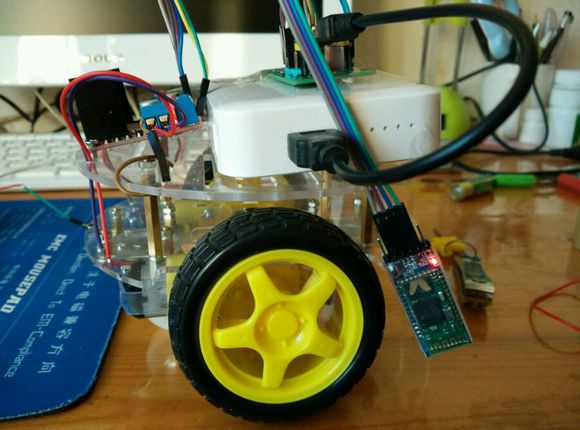
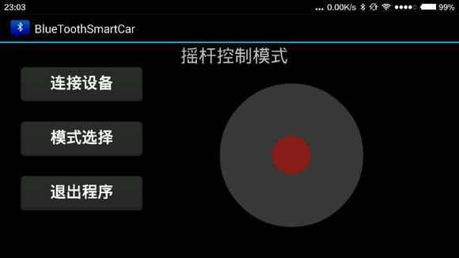
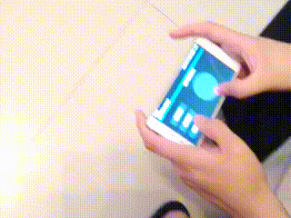
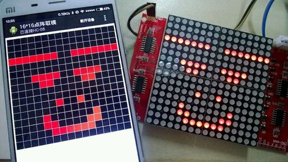
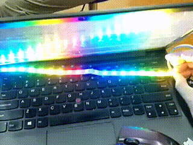

# IoT-DIY
做过的一些电子(物联网)DIY。

## [DIY01——蓝牙小车](./01-蓝牙小车)
### 状态
代码已整理
### 图片
#### 小车

#### 安卓 APP

#### 效果

## [DIY02——涂鸦点阵](./02-涂鸦点阵)
### 状态
代码已整理
### 图片
#### 安卓 APP

#### iOS APP

## [DIY03——PM2.5检测仪](./03-PM2.5检测仪)
### 状态
已完成
### 说明
详情见： [教你DIY一个PM2.5检测仪](http://nladuo.github.io/2015/12/09/%E6%95%99%E4%BD%A0DIY%E4%B8%80%E4%B8%AAPM2.5%E6%A3%80%E6%B5%8B%E4%BB%AA/)

## [DIY04——PM2.5检测仪2.0](./04-PM2.5检测仪2.0)
### 说明
和DIY3相比，Android使用Android Studio重构，支持Android6.0的权限系统。新增了小程序版本的上位机。
### 状态
已完成
### 说明
详情见：[冬天又要到了，自己动手DIY一个PM2.5检测仪把！](https://mp.weixin.qq.com/s?__biz=MzUyMTAzNTk3NA==&mid=2247483725&idx=1&sn=7a982b627b0f5b32346fce608e08316e&chksm=f9e008e4ce9781f23d3135ab7a4f67819c907892a07ce197e54032faa22409b7b6449bc9e4aa&scene=0&key=cddc325a4ccd2d6572509b93b984d6b2032802c1a8c3e8d6943bd667b0fe184be0a57cb2a37c7c93e93a4da6b520837c82bd0e8e065b53e6ae1ff9852a7617d5b04d6a8806e6f1d6d6f20fe436205b10&ascene=0&uin=NzA0NjM2NjIw&devicetype=iMac+MacBookPro12%2C1+OSX+OSX+10.12.3+build(16D32)&version=12020810&nettype=WIFI&fontScale=100&pass_ticket=5HoBqFJ8KxFqyiIaGjlYSi4bPcTKcBRgtcBmeoKaq7L%2BG9h7pzaFODuEq6yOmDiw)

## [DIY05——幻彩灯带](./05-幻彩灯带)
### 状态
已完成
### 效果

# LICENSE
GPLv3
