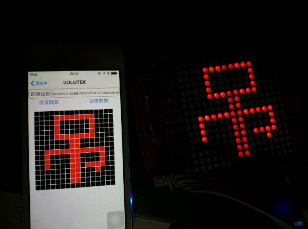

# IoT-DIY
做过的一些和物联网有关的DIY。

## [DIY01——蓝牙小车](./01蓝牙小车)
### 状态
未整理
### 图片
#### 小车

#### 安卓 APP

## [DIY02——点阵控制器](./02点阵控制器)
### 状态
未整理
### 图片
#### 安卓 APP

#### iOS APP

## [DIY03——PM2.5检测仪](./03PM2.5检测仪)
### 状态
已完成
### 图片
详情见： http://nladuo.github.io/2015/12/09/%E6%95%99%E4%BD%A0DIY%E4%B8%80%E4%B8%AAPM2.5%E6%A3%80%E6%B5%8B%E4%BB%AA/

## [DIY04——室内传感器监控](./室内传感器监控)
### 状态
开发中
### 图片
暂无